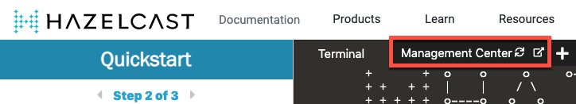
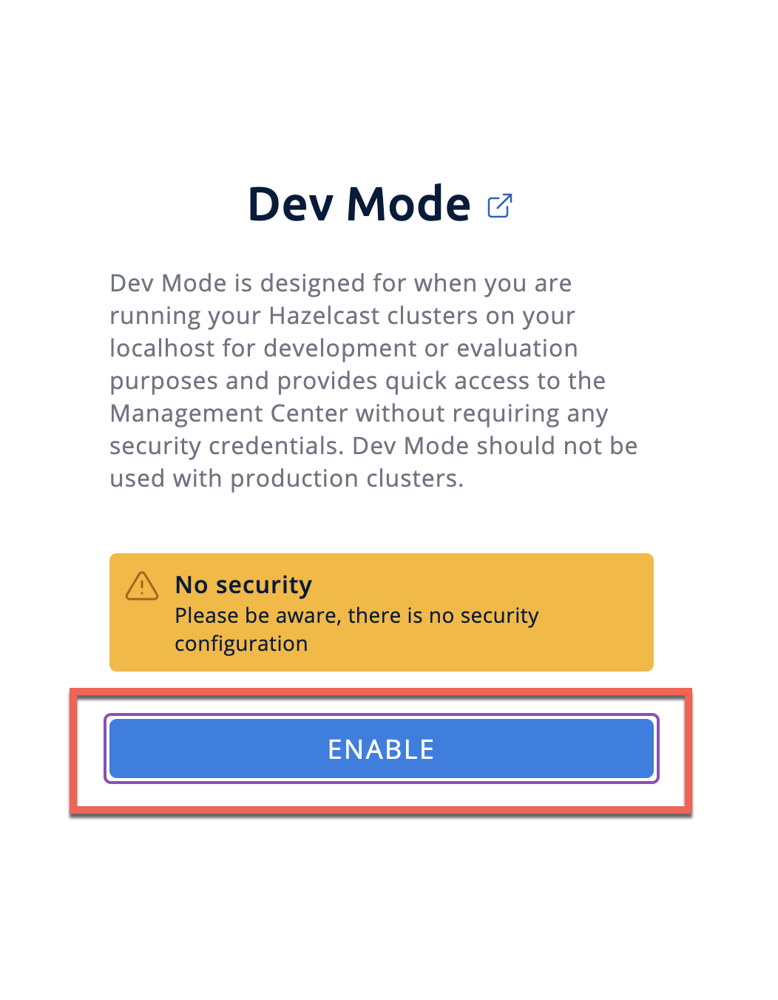

1. Click the text below twice to start another member in a different window.

    `hz start`{{execute T2}}

1. Then, click the text below twice to start Management Center in another window.

    `hz mc start`{{execute T3}}

    You should see that Hazelcast Management Center successfully started.

1. To open Management Center, click the tab labelled Management Center.

    

1. On the landing page of Management Center, enable dev mode.

    

1. Create a connection, using the default settings.

You should see that you cluster is in an `ACTIVE` state and has a single member. An active cluster is stable and operating without restrictions.